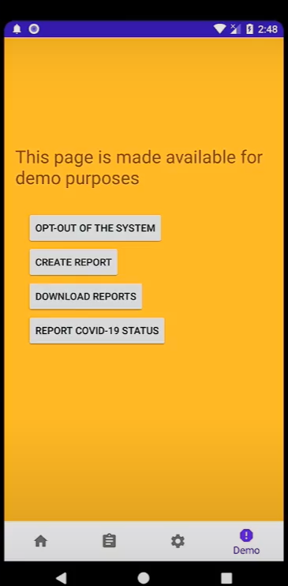
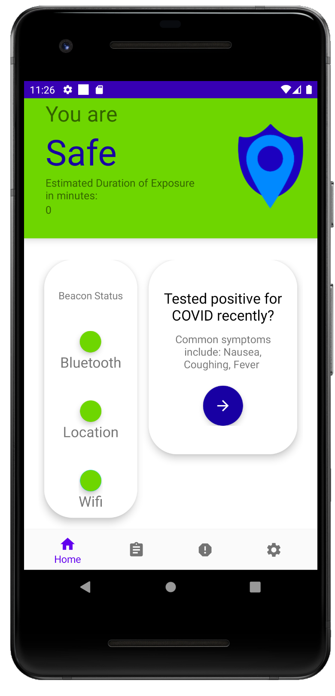
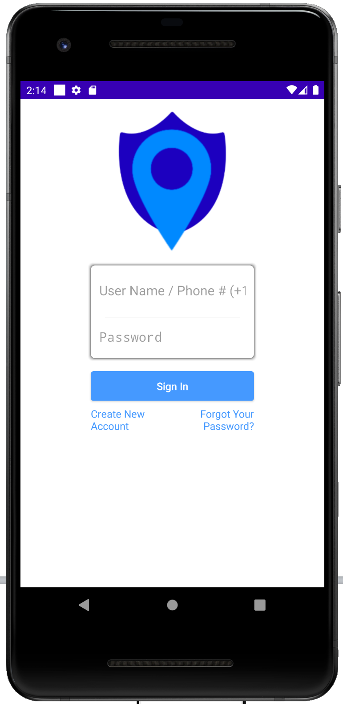
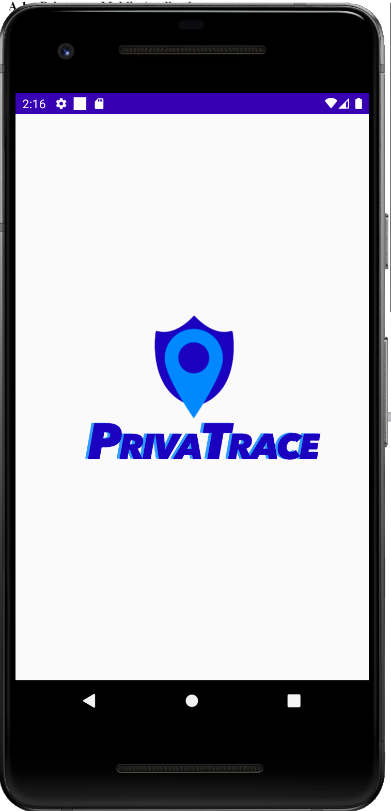

<!-- PROJECT LOGO -->
<br />
<p align="center">
  <a href="https://github.com/ps-balucan/CTeee/blob/master/app/src/main/res/drawable/splash_page.png">
    
  </a>

  <h3 align="center">Privatrace (Mobile App) </h3>

  <p align="center">
    A differentially-private contact tracing and indoor foot traffic system
    <br />
    <a href="https://github.com/claudynetrixie/contact_tracing"><strong>Explore the docs »</strong></a>
    <br />
    <br />
  </p>
</p>


<!-- TABLE OF CONTENTS -->
<details open="open">
  <summary>Table of Contents</summary>
  <ol>
    <li>
      <a href="#about-the-project">About The Project</a>
      <ul>
        <li><a href="#web-server">Web Server</a></li>
        <li><a href="#mobile-application">Mobile Application</a></li>
        <li><a href="#built-with">Built With</a></li>
      </ul>
    </li>
    <li>
      <a href="#setup">Setup</a>
    </li>
    <li>
      <a href="#screenshots">Screenshots</a>
    </li>
   
  </ol>
</details>


<!-- ABOUT THE PROJECT -->
## About The Project

<p align = "center">

</p>

Privatrace seeks to strike a balance between both privacy and utility in implementing a contact tracing system. It involves a decentralized contact tracing approach paired with a differentially-private collection of foot traffic data. Privatrace conducts contact tracing without sharing users' data outside of their personal phones, and it uses differentially privatized data in foot traffic analysis to augment contact tracing efforts with insight into user movements to maximize the allocation of resources. Other than privacy and utility, strict user security was also implemented through the use of end-to-end encryption. This contact tracing system is composed an Android mobile application implemented using Java, a Web Application implemented using Django and AWS, and BLE beacons for location tracking.


### <ins>Web Server</ins>

The web server serves as the front-end for the aggregate report of the analyst and the back-end for functions mentioned below. 

Functions:
* Temporary API token
* Exposure Notifications
* Aggregate Report (Creation and Aggregation)

link: [Web Application Repository] (https://github.com/claudynetrixie/contact_tracing)

### <ins>Mobile Application </ins>
The mobile application plays an integral role in the contact tracing system proposed. It functions as the client facing portion of our system and will be the platform that the users can use to interact with the functions offered by our contact tracing system. Despite playing an external role in the system, the mobile application still contains a back-end and front-end portion, namely the database design and the mobile application functions. 

Functions:
* Location Logging
* Exposure Notifications
* Aggregate Report (Creation and Aggregation)
* Opt-out of the System

link: [Mobile Application Repository](https://github.com/ps-balucan/CTeee)
 

### <ins>Built With </ins>

Mobile Application
* Java
*AltBeacon Library (For Bluetooth Scanning and Logging functionality)
*XML
*Retrofit (for REST functionality)
*Okhttp
*SQLite (Mobile database)
*End to End Encryption of location data (AES/CBC/PKCS5Padding)
*Firebase Notification Manager
*AWS Services (API Gateway, Cognito)


## Setup

The first thing to do is to clone the repository:

```sh
$ git clone https://github.com/claudynetrixie/contact_tracing
```
Open it on Android Studio and download any required libraries to sync with the project.

Afterwards, you should be able to run the application simulated in android studio or install it on an android phone.

For reference, the application was mainly tested on the following versions of android:
```sh
Android 10
```

## Screenshots

<p float = "left">





</p>


